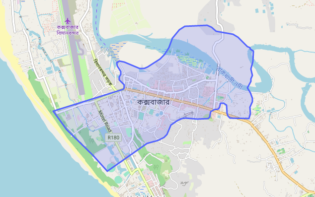
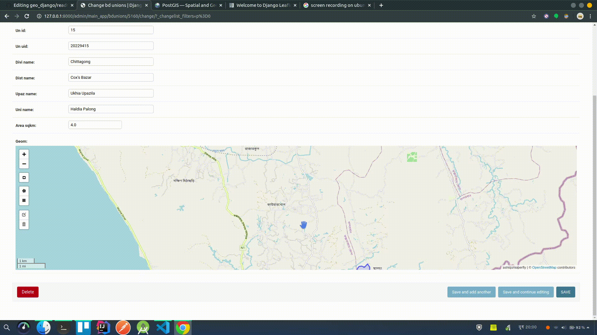

## GeoDjango

This repository demonstrates how you can parse shapefiles and populate the GIS data into a postgres database.

#### Demo

#### Useful Links
<a href="https://postgis.net/">PostGIS</a>

<a href="https://django-leaflet.readthedocs.io/en/latest/">Leaflet</a>

<a href="https://geodash.gov.bd/layers/">BD Unions ShapeFile Downloaded From Here</a>
